# 0 功能需求

采用AD1313R提供0~5 V的直流电压供给外部驱动器

# 1 AD1313R特性

- 使用SPI进行参数配置
- 双端口输出

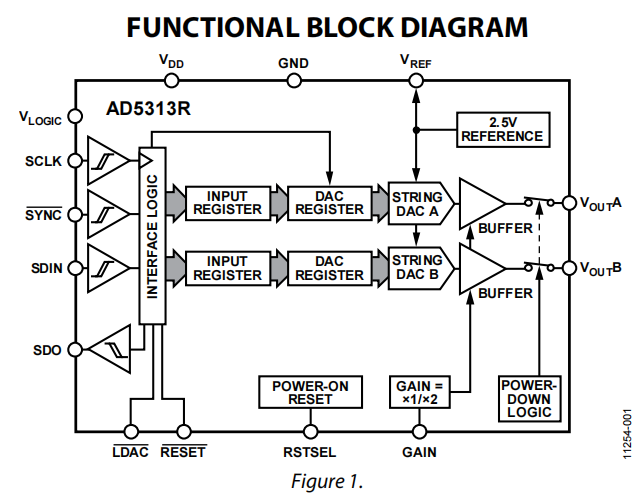

# 2 数字端口声明

所有的TYPE是针对AD来说的，实现：

- HH：硬件拉高

- HL：硬件拉低

| PIN     | TYPE  | DESCRIPTION                                 | 实现 |
| ------- | ----- | ------------------------------------------- | ---- |
| SDO     | DO    | 串行数据输出，数据在SCLK上升沿传输          |      |
| LDAC_n  | DI    | 0： DAC同步输出 1： DAC异步输出             | HL   |
| GAIN    | DI    | 0：DAC【0，V~REF~】V~LOGIC~：【0，2V~REF~】 | HH   |
| SCLK    | DI    | 串行时钟输入，**数据在SCLK的下降沿被输入**  |      |
| SYNC_n  | DI    | 0: 数据将在接下来的24个SCLK下降沿输入       |      |
| SDIN    | DI    | 串行数据输入                                |      |
| RESET_n | DI    | 异步复位输入，下降沿敏感                    |      |
| RSTSEL  | DI    | 上电复位选择 0：0偏 V~LOGIC~: 中偏          | HL   |
| V~REF~  | AI/AO | 默认为参考电压输出                          |      |

# 3 时序

## 串行写入

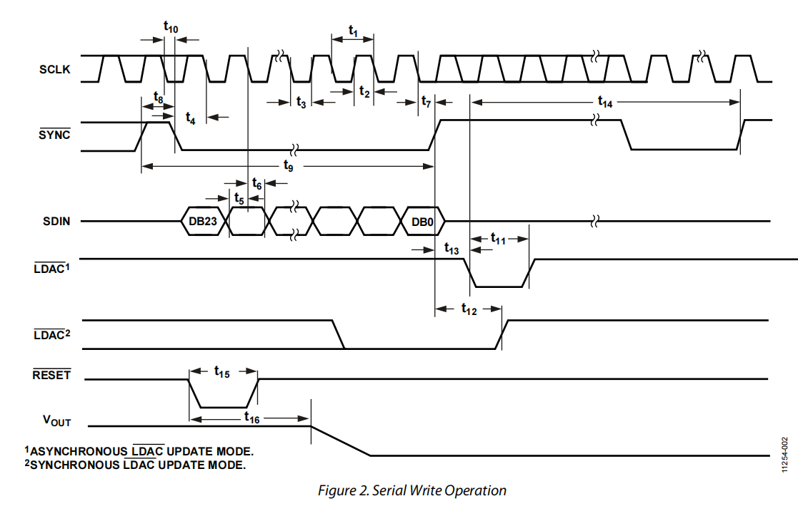

串行数据输入由SYNC开始，之后的24个SCLK载入数据。设计SCLK采用40MHz时钟，以下参数采用V~LOGIC~为3.3V情况：

## 时间参数

| 参数 | 描述                           | 要求    | 设计                 |
| ---- | ------------------------------ | ------- | -------------------- |
| t1   | SCLK周期                       | > 20ns  | 25ns                 |
| t4   | SYNC下降沿到下一个SCLK下降沿   | > 10ns  | 12.5ns（2.5sys_clk） |
| t7   | 最后一个SCLK下降沿到SYNC上升沿 | > 10ns  | 12.5ns               |
| t8   | SYNC高电平时间                 | > 20ns  | 250ns（10SCLK）      |
| t9   | 两次SYNC上升沿之间间隔         | > 830ns | > 850ns              |
| t10  | SYNC下降沿到前一个SCLK下降沿   | > 10ns  | 12.5ns               |
| t5   | 数据到SCLK下降沿建立时间       | > 5ns   | 12.5ns               |
| t6   | 数据到SCLK下降沿保持时间       | > 5ns   | 12.5ns               |
| t15  | RESET低电平时间                | > 30ns  | 100ns                |

## 设计

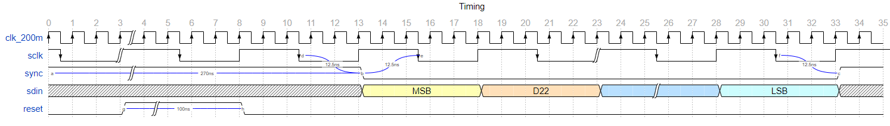

调整rese仅在上电之后执行一次

## 串行回读

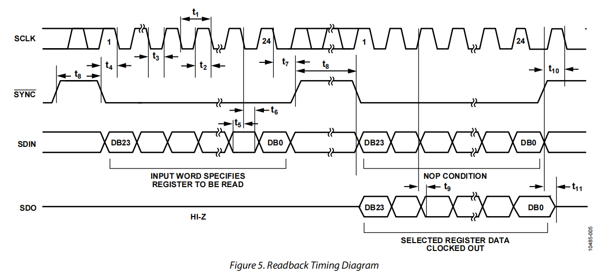

数据回读SDO在上升沿发送，在下降沿可以进行读取

# 4 寄存器配置

## 电压计算公式

设计使用内部参考电压为V~REF~=2.5V，增益Gain=2，输出电压公式如下：

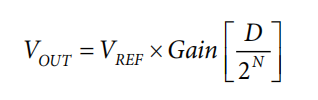

其中n=10

## 输入寄存器结构

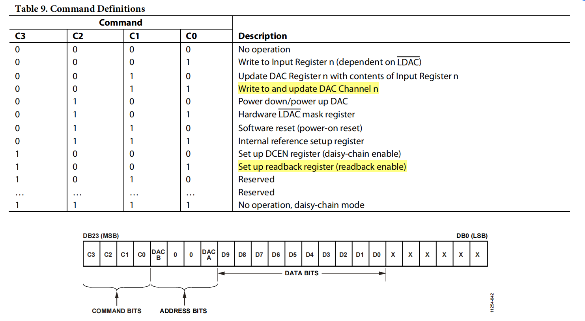

## 地址信息

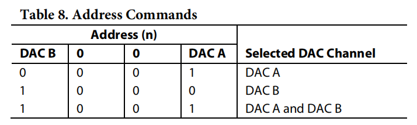

## 命令信息

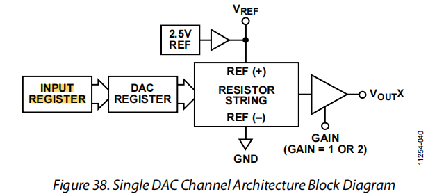

这个芯片有两级寄存器：

- 一个为输入寄存器用于缓存输入的配置
- 一个为DAC寄存器用于实际控制DAC输出

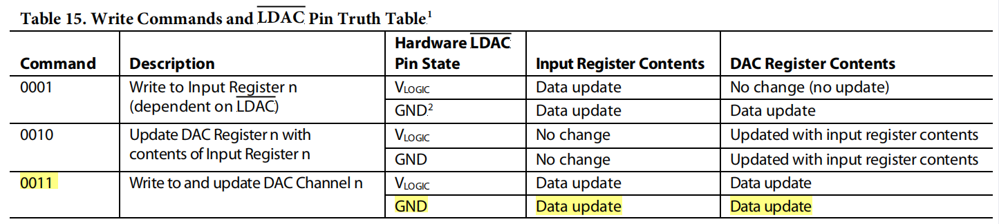

对应常用的写命令如表15所示3种：

- 命令1：将配置写入输入寄存器，DAC寄存器是否更新取决于LDAC
- 命令2：将DAC寄存器的内容更新为输入寄存器
- 命令3：直接写入DAC寄存器，同时更新输入寄存器

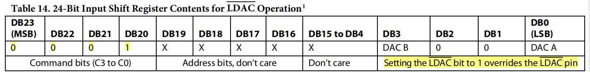

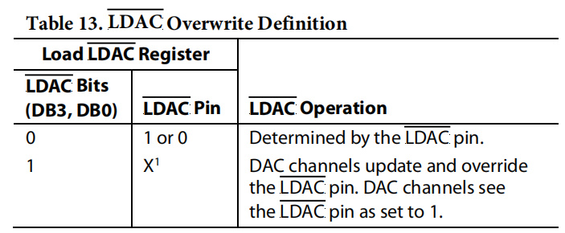

需要的功能主要有两个：配置电压和回传参数

### 配置电压

硬件上把LDAC直接拉地，这里采用命令3（独立于LDAC配置），将数据直接写入DAC寄存器：

| bit  | 23-20 | 19-16 | 15-12 | 11-08 | 07-04 | 03-00 |
| ---- | ----- | ----- | ----- | ----- | ----- | ----- |
|      | 3     | 9     | X     | X     | X     | 0     |

### 回传参数

回传A寄存器的参数，第一次写READ

| bit  | 23-20 | 19-16 | 15-12 | 11-08 | 07-04 | 00-03 |
| ---- | ----- | ----- | ----- | ----- | ----- | ----- |
|      | 9     | 1     | 0     | 0     | 0     | 0     |

第二次写NOP

| bit  | 23-20 | 19-16 | 15-12 | 11-08 | 07-04 | 03-00 |
| ---- | ----- | ----- | ----- | ----- | ----- | ----- |
|      | 0     | 0     | 0     | 0     | 0     | 0     |

回传内容

| bit  | 23-20 | 19-16 | 15-12 | 11-08 | 07-04 | 03-00 |
| ---- | ----- | ----- | ----- | ----- | ----- | ----- |
|      | 9     | X     | Valid | Valid | Valid | Valid |

回传的最后16位对应的是【DB19,DB4】的内容

# 5控制帧结构

## 控制帧

每个序号代表16-bit

| 序号 | 名称            | 含义      | 值                             |
| ---- | --------------- | --------- | ------------------------------ |
| 0-1  | FLAG_MOTOR      | 标识位    | E1EC_0C0D                      |
| 2    | motor_state     | 电机状态  | 0xEAEA：启动 others：停止 |
| 3    | motor_direction | 电机方向  | 0x1EAF：正转 others：反转 |
| 4    | dac_voltage     | DAC电压值 | 低10bit有效                    |
| 5    | alarm_reset     | 复位警报  | 0xAAED：复位 others：正常 |
|      |                 |           |                                |
|      |                 |           |                                |

## 返回帧

每个序号代表16-bit

| 序号 | 名称            | 含义         | 值                                     |
| ---- | --------------- | ------------ | -------------------------------------- |
| 0-1  | FLAG_MOTOR      | 标识位       | E1EC_0C0D                              |
| 2    | motor_state     | 电机状态     | 0xEAEA：启动 others：停止         |
| 3    | motor_direction | 电机方向     | 0x1EAF：正转 others：反转         |
| 4    | dac_voltage     | DAC电压值    | 低10bit有效                            |
| 5    | alarm_out       | 警报发生     | 0xAAAA：警报发生 others：正常     |
| 6    | dac_complete    | DAC设定完成  | 0xFBFB：设定成功 others：设定失败 |
| 7    | alarm_complete  | 警报复位完成 | 0xAAED：复位 others：正常         |